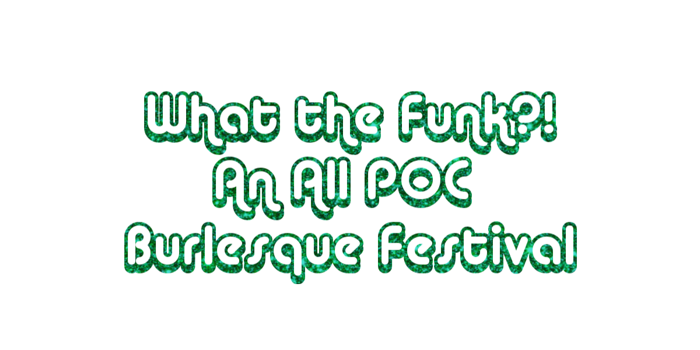

<div class="ui small rounded images">
  
</div>

What the Funk?! is produced by Puckduction in association with The Stay Up late Show*. Featuring 50+ performers over the weekend, What the Funk?! will be hosting three shows plus two days of classes. With headliners Egypt Blaque Knyle, Nox Falls, Tre` da Marc and The Luminous Pariah, Pacific Northwest featured performers Ms. Briq House, The Shanghai Pearl, spICE! and Isaiah Esquire as well as special guests, Foxy Tann, The Boss of Burlesque, this festival is a celebration of all things funky! The opening night gala will take place at Queer/Bar on Capitol Hill with nights two and three at the historic Columbia City Theater, hosted by Rebecca Mmm Davis. Tickets are currently on sale through Stranger Tickets and Brown Paper Tickets.

“What the Funk?! will be a celebration of funk music and the art of burlesque,” says co-producer Mx. Pucks A’Plenty, “this festival was conceived as a show idea in early 2018 after I thought about doing a classic burlesque number to a Stevie Wonder song, but realized it wouldn't count as a classic era song choice. This got my wheels turning and What the Funk?! was born. I couldn’t be more thrilled about bringing this festival to life here in the city of my birth.”  

For this project, I was the lead audio engineer responsible for capturing audio from the on-stage performers and back-stage crew.
```

You can learn more at the [What the Funk!? Website](https://www.whatthefunkfest.com/press-release).
